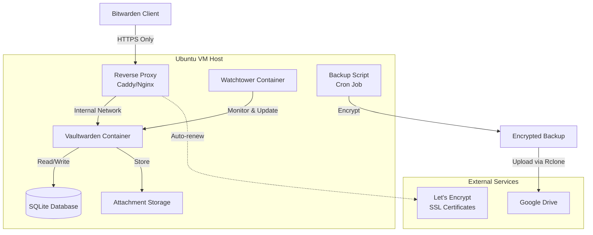

# Technical Specification: Self-Hosted Personal Password Manager

## Table of Contents

1. [Project Overview & Goals](#1-project-overview--goals)
   - 1.1 [Purpose](#11-purpose)
   - 1.2 [Core Objectives](#12-core-objectives)
   - 1.3 [Technical Constraints](#13-technical-constraints)
   - 1.4 [Success Criteria](#14-success-criteria)

2. [System Architecture](#2-system-architecture)
   - 2.1 [High-Level Architecture](#21-high-level-architecture)
   - 2.2 [Component Architecture](#22-component-architecture)
   - 2.3 [Data Flow](#23-data-flow)
   - 2.4 [Technology Stack](#24-technology-stack)

3. [Infrastructure & Deployment Strategy](#3-infrastructure--deployment-strategy)
   - 3.1 [Infrastructure Requirements](#31-infrastructure-requirements)
   - 3.2 [Directory Structure](#32-directory-structure)
   - 3.3 [Docker Compose Configuration](#33-docker-compose-configuration)
   - 3.4 [Reverse Proxy Configuration](#34-reverse-proxy-configuration)
   - 3.5 [Deployment Procedure](#35-deployment-procedure)
   - 3.6 [Resource Tagging and Cost Management](#36-resource-tagging-and-cost-management)
   - 3.7 [Infrastructure as Code (IaC) and CI/CD Automation](#37-infrastructure-as-code-iac-and-cicd-automation)
   - 3.8 [Post-Deployment Configuration](#38-post-deployment-configuration)

4. [Security Specification](#4-security-specification)
   - 4.1 [Zero-Knowledge Architecture](#41-zero-knowledge-architecture)
   - 4.2 [Network Security](#42-network-security)
   - 4.3 [Application Security](#43-application-security)
   - 4.4 [Access Control](#44-access-control)
   - 4.5 [Security Monitoring](#45-security-monitoring)

5. [Data Protection (Backup & Disaster Recovery)](#5-data-protection-backup--disaster-recovery)
   - 5.1 [Backup Strategy](#51-backup-strategy)
   - 5.2 [Disaster Recovery](#52-disaster-recovery)
   - 5.3 [Backup Storage Security](#53-backup-storage-security)

6. [Maintenance & Automation Strategy](#6-maintenance--automation-strategy)
   - 6.1 [Automated Updates](#61-automated-updates)
   - 6.2 [Monitoring & Health Checks](#62-monitoring--health-checks)
   - 6.3 [System Maintenance](#63-system-maintenance)
   - 6.4 [Operational Procedures](#64-operational-procedures)
   - 6.5 [Troubleshooting](#65-troubleshooting)
   - 6.6 [Documentation Maintenance](#66-documentation-maintenance)

- [Appendix A: Quick Reference](#appendix-a-quick-reference)
- [Appendix B: Migration Guide](#appendix-b-migration-guide)

---

## 1. Project Overview & Goals

### 1.1 Purpose

This specification defines a self-hosted, secure, and maintenance-free personal password manager solution based on Vaultwarden (a Rust-based, Bitwarden-compatible server). The system is designed to provide enterprise-grade password management capabilities while maintaining complete data sovereignty and vendor independence.

### 1.2 Core Objectives

- **Security First**: Implement zero-knowledge architecture ensuring the server never has access to plaintext passwords
- **Vendor Agnostic**: Deployable on any infrastructure (Azure VM, AWS EC2, DigitalOcean, local machine, etc.) without vendor lock-in
- **Zero-Touch Maintenance**: Automated updates, backups, and monitoring requiring minimal manual intervention
- **Production Ready**: HTTPS-only access with automatic SSL certificate management
- **Disaster Recovery**: One-command restore capability for complete system recovery

### 1.3 Technical Constraints

- **Initial Deployment Target**: Azure Virtual Machine (Ubuntu LTS)
- **Vendor Independence**: No Azure-specific services (Azure SQL, Azure Backup, etc.)
- **Container-Based**: All services run in Docker containers for portability
- **Network Security**: Only ports 80 and 443 exposed to the internet
- **Protocol Enforcement**: HTTP traffic must be automatically redirected to HTTPS

### 1.4 Success Criteria

- System can be deployed on a fresh Ubuntu VM in under 30 minutes
- Automated backups run nightly without manual intervention
- Container updates are applied automatically within 24 hours of stable release
- Complete system restore can be performed with a single command
- Zero unencrypted data transmission over the network

## 2. System Architecture

### 2.1 High-Level Architecture

The system follows a three-tier architecture:

```
┌─────────────┐
│   Client    │ (Bitwarden Desktop/Mobile/Web)
│  (Browser)  │
└──────┬──────┘
       │ HTTPS (TLS 1.3)
       │
┌──────▼──────────────────────────────────────┐
│         Reverse Proxy Layer                │
│  ┌──────────────────────────────────────┐  │
│  │  Caddy/Nginx + Let's Encrypt         │  │
│  │  - Automatic SSL certificate renewal │  │
│  │  - HTTP → HTTPS redirect              │  │
│  │  - Rate limiting                      │  │
│  └──────────────┬───────────────────────┘  │
└─────────────────┼──────────────────────────┘
                  │
┌─────────────────▼──────────────────────────┐
│         Application Layer                  │
│  ┌──────────────────────────────────────┐  │
│  │      Vaultwarden Container           │  │
│  │  - Rust-based Bitwarden server       │  │
│  │  - SQLite database                    │  │
│  │  - Attachment storage                │  │
│  │  - Zero-knowledge encryption         │  │
│  └──────────────────────────────────────┘  │
└─────────────────────────────────────────────┘
```

### 2.2 Component Architecture



### 2.3 Data Flow

#### 2.3.1 Authentication Flow

1. Client sends encrypted credentials to Vaultwarden via HTTPS
2. Vaultwarden performs authentication using encrypted hash comparison
3. Server never sees plaintext master password (zero-knowledge)
4. Session token issued upon successful authentication

#### 2.3.2 Password Storage Flow

1. Client encrypts password entries locally using master password-derived key
2. Encrypted data sent to Vaultwarden via HTTPS
3. Vaultwarden stores encrypted data in SQLite database
4. Server cannot decrypt stored passwords (zero-knowledge)

#### 2.3.3 Backup Flow

1. Cron job triggers backup script nightly
2. Script creates SQLite dump and compresses attachments
3. Backup archive encrypted using GPG with passphrase
4. Encrypted backup uploaded to Google Drive via Rclone
5. Local backup files deleted after successful upload
6. Retention policy: Keep last 30 days of backups

### 2.4 Technology Stack

| Component | Technology | Version | Purpose |
|-----------|-----------|---------|---------|
| **Application Server** | Vaultwarden | Latest stable | Bitwarden-compatible password manager |
| **Reverse Proxy** | Caddy | Latest stable | HTTPS termination, SSL automation |
| **Container Runtime** | Docker | 24.0+ | Container orchestration |
| **Orchestration** | Docker Compose | 2.20+ | Multi-container management |
| **Database** | SQLite | 3.x (embedded) | Data persistence (embedded in Vaultwarden container) |
| **Update Automation** | Watchtower | Latest stable | Container update automation |
| **Backup Tool** | Rclone | Latest stable | Cloud storage synchronization |
| **Encryption** | GPG | 2.x | Backup encryption |
| **SSL Certificates** | Let's Encrypt | Auto-renewed | TLS certificates |
| **Operating System** | Ubuntu LTS | 22.04+ | Host operating system |

## 3. Infrastructure & Deployment Strategy

### 3.1 Infrastructure Requirements

#### 3.1.1 Minimum System Requirements

- **CPU**: 2 vCPUs
- **RAM**: 2 GB minimum (4 GB recommended)
- **Storage**: 20 GB minimum (50 GB recommended for attachments)
- **Network**: Static IP address or dynamic DNS
- **OS**: Ubuntu 22.04 LTS or later

#### 3.1.1.1 SQLite Installation

**SQLite is not manually installed** - it comes pre-installed and embedded within the Vaultwarden Docker container. The Vaultwarden image includes SQLite 3.x as a compiled library dependency. When the container starts:

1. Vaultwarden automatically initializes the SQLite database file (`db.sqlite3`) if it doesn't exist
2. The database is stored in the mounted volume at `/opt/vaultwarden/vaultwarden/data/db.sqlite3`
3. All database operations (create, read, update, delete) are handled by Vaultwarden's Rust codebase
4. No separate SQLite installation or configuration is required on the host system

The `sqlite3` command-line tool used in backup scripts is installed separately via the host system's package manager (Ubuntu's `sqlite3` package) for backup operations only.

#### 3.1.2 Network Configuration

- **Inbound Ports**: 
  - Port 80 (HTTP) - Redirects to HTTPS
  - Port 443 (HTTPS) - Primary access
- **Outbound Ports**: 
  - Port 443 (HTTPS) - Let's Encrypt, Google Drive API
- **Firewall**: UFW (Uncomplicated Firewall) configured to allow only 80/443

### 3.2 Directory Structure

```
/opt/vaultwarden/
├── docker-compose.yml          # Main orchestration file
├── .env                         # Environment variables (secrets)
├── caddy/
│   ├── Caddyfile               # Reverse proxy configuration
│   └── data/                   # Caddy data directory
├── vaultwarden/
│   ├── data/                   # Vaultwarden data directory
│   │   ├── db.sqlite3          # SQLite database
│   │   └── attachments/        # User attachments
│   └── config/                 # Vaultwarden configuration
├── scripts/
│   ├── backup.sh               # Backup automation script
│   ├── restore.sh              # Disaster recovery script
│   └── setup.sh                # Initial deployment script
└── backups/                    # Temporary backup location (local)
```

### 3.3 Docker Compose Configuration

#### 3.3.1 Main Configuration (`docker-compose.yml`)

```yaml
version: '3.8'

services:
  vaultwarden:
    image: vaultwarden/server:latest
    container_name: vaultwarden
    restart: unless-stopped
    environment:
      - WEBSOCKET_ENABLED=true
      - SIGNUPS_ALLOWED=false
      - DOMAIN=https://your-domain.com
      - ADMIN_TOKEN=${ADMIN_TOKEN}
      - DATABASE_URL=/data/db.sqlite3
    volumes:
      - ./vaultwarden/data:/data
    networks:
      - vaultwarden-network
    labels:
      - "com.centurylinklabs.watchtower.enable=true"

  caddy:
    image: caddy:latest
    container_name: caddy
    restart: unless-stopped
    ports:
      - "80:80"
      - "443:443"
      - "443:443/udp"
    volumes:
      - ./caddy/Caddyfile:/etc/caddy/Caddyfile
      - ./caddy/data:/data
      - ./caddy/config:/config
    networks:
      - vaultwarden-network
    depends_on:
      - vaultwarden
    labels:
      - "com.centurylinklabs.watchtower.enable=true"

  watchtower:
    image: containrrr/watchtower:latest
    container_name: watchtower
    restart: unless-stopped
    volumes:
      - /var/run/docker.sock:/var/run/docker.sock
    environment:
      - WATCHTOWER_CLEANUP=true
      - WATCHTOWER_POLL_INTERVAL=86400
      - WATCHTOWER_INCLUDE_STOPPED=false
      - WATCHTOWER_REVIVE_STOPPED=false
    command: --interval 86400

networks:
  vaultwarden-network:
    driver: bridge
```

#### 3.3.2 Environment Variables (`.env`)

```bash
# Vaultwarden Configuration
ADMIN_TOKEN=<generate-strong-random-token>
DOMAIN=https://your-domain.com

# Backup Configuration
BACKUP_ENCRYPTION_KEY=<gpg-key-id-or-passphrase>
RCLONE_REMOTE_NAME=gdrive
BACKUP_RETENTION_DAYS=30

# Google Drive (Rclone)
# Configured separately via: rclone config
```

### 3.4 Reverse Proxy Configuration

#### 3.4.1 Caddy Configuration (`caddy/Caddyfile`)

```
your-domain.com {
    # Automatic HTTPS with Let's Encrypt
    encode zstd gzip
    
    # Security headers
    header {
        # Enable HSTS
        Strict-Transport-Security "max-age=31536000; includeSubDomains; preload"
        # Prevent clickjacking
        X-Frame-Options "DENY"
        # XSS protection
        X-Content-Type-Options "nosniff"
        # Referrer policy
        Referrer-Policy "strict-origin-when-cross-origin"
    }
    
    # Rate limiting
    rate_limit {
        zone dynamic {
            key {remote_host}
            events 50
            window 1m
        }
    }
    
    # Reverse proxy to Vaultwarden
    reverse_proxy vaultwarden:80 {
        header_up X-Real-IP {remote_host}
        header_up X-Forwarded-For {remote_host}
        header_up X-Forwarded-Proto {scheme}
    }
    
    # WebSocket support for real-time sync
    reverse_proxy /notifications/hub vaultwarden:3012 {
        transport http {
            versions h2c
        }
    }
}

# Redirect HTTP to HTTPS
http://your-domain.com {
    redir https://your-domain.com{uri} permanent
}
```

#### 3.4.2 Alternative: Nginx Configuration

If using Nginx instead of Caddy:

```nginx
server {
    listen 80;
    server_name your-domain.com;
    return 301 https://$server_name$request_uri;
}

server {
    listen 443 ssl http2;
    server_name your-domain.com;
    
    ssl_certificate /etc/letsencrypt/live/your-domain.com/fullchain.pem;
    ssl_certificate_key /etc/letsencrypt/live/your-domain.com/privkey.pem;
    ssl_protocols TLSv1.2 TLSv1.3;
    ssl_ciphers HIGH:!aNULL:!MD5;
    
    # Security headers
    add_header Strict-Transport-Security "max-age=31536000; includeSubDomains; preload" always;
    add_header X-Frame-Options "DENY" always;
    add_header X-Content-Type-Options "nosniff" always;
    
    location / {
        proxy_pass http://vaultwarden:80;
        proxy_set_header Host $host;
        proxy_set_header X-Real-IP $remote_addr;
        proxy_set_header X-Forwarded-For $proxy_add_x_forwarded_for;
        proxy_set_header X-Forwarded-Proto $scheme;
    }
    
    location /notifications/hub {
        proxy_pass http://vaultwarden:3012;
        proxy_http_version 1.1;
        proxy_set_header Upgrade $http_upgrade;
        proxy_set_header Connection "upgrade";
    }
}
```

### 3.5 Deployment Procedure

#### 3.5.1 Initial Setup Script (`scripts/setup.sh`)

```bash
#!/bin/bash
set -e

# Update system
sudo apt-get update && sudo apt-get upgrade -y

# Install Docker
if ! command -v docker &> /dev/null; then
    curl -fsSL https://get.docker.com -o get-docker.sh
    sudo sh get-docker.sh
    sudo usermod -aG docker $USER
    rm get-docker.sh
fi

# Install Docker Compose
if ! command -v docker-compose &> /dev/null; then
    sudo curl -L "https://github.com/docker/compose/releases/latest/download/docker-compose-$(uname -s)-$(uname -m)" -o /usr/local/bin/docker-compose
    sudo chmod +x /usr/local/bin/docker-compose
fi

# Install Rclone
if ! command -v rclone &> /dev/null; then
    curl https://rclone.org/install.sh | sudo bash
fi

# Install GPG (if not present)
sudo apt-get install -y gnupg2

# Create directory structure
sudo mkdir -p /opt/vaultwarden/{caddy/{data,config},vaultwarden/data,scripts,backups}
sudo chown -R $USER:$USER /opt/vaultwarden

# Generate admin token
ADMIN_TOKEN=$(openssl rand -base64 48)
echo "ADMIN_TOKEN=$ADMIN_TOKEN" > /opt/vaultwarden/.env
echo "DOMAIN=https://your-domain.com" >> /opt/vaultwarden/.env
echo "BACKUP_RETENTION_DAYS=30" >> /opt/vaultwarden/.env

# Configure firewall
sudo ufw allow 80/tcp
sudo ufw allow 443/tcp
sudo ufw --force enable

echo "Setup complete. Please:"
echo "1. Edit /opt/vaultwarden/.env with your domain"
echo "2. Configure Rclone: rclone config"
echo "3. Set up GPG encryption key"
echo "4. Run: cd /opt/vaultwarden && docker-compose up -d"
```

#### 3.5.2 Deployment Steps

**Manual Deployment (Current Method):**

1. **Provision VM**: Create Ubuntu 22.04 LTS VM on Azure (or any provider)
2. **DNS Configuration**: Point domain A record to VM's public IP
3. **Run Setup Script**: Execute `scripts/setup.sh` on the VM
4. **Configure Environment**: Edit `.env` file with actual domain and generate secrets
5. **Configure Rclone**: Run `rclone config` to set up Google Drive connection
6. **Set Up GPG**: Generate or import GPG key for backup encryption
7. **Deploy Services**: Run `docker-compose up -d`
8. **Verify Deployment**: Access `https://your-domain.com` and create admin account
9. **Disable Signups**: Set `SIGNUPS_ALLOWED=false` in docker-compose.yml (already set)
10. **Configure Backup Cron**: Add backup script to crontab

**Note**: For automated deployment using Infrastructure as Code (IaC) and CI/CD pipelines, see Section 3.7.

### 3.6 Resource Tagging and Cost Management

#### 3.6.1 Azure Resource Tags

All Azure resources should be tagged for cost tracking and resource management:

| Tag Key | Tag Value | Purpose |
|---------|-----------|---------|
| `Project` | `password-manager` | Project identification |
| `Environment` | `production` | Environment classification |
| `Component` | `vaultwarden` | Application component |
| `ManagedBy` | `terraform` or `manual` | Management method |
| `CostCenter` | `personal` | Cost allocation |
| `Backup` | `enabled` | Backup status |
| `Owner` | `<your-email>` | Resource owner |

#### 3.6.2 Cost Estimation and Analysis

**Azure VM Cost Breakdown (India Central/South Region):**

| Resource | SKU | Monthly Cost (INR) | Notes |
|----------|-----|-------------------|-------|
| **Virtual Machine** | Standard_B2s (2 vCPU, 4 GB RAM) | ₹2,200 - ₹2,800 | Pay-as-you-go pricing |
| **OS Disk** | Premium SSD 64 GB | ₹600 - ₹800 | Managed disk |
| **Data Disk** | Standard HDD 50 GB (optional) | ₹200 - ₹300 | For attachments |
| **Public IP** | Basic Static IP | ₹0 - ₹200 | First 5 IPs free, then charged |
| **Bandwidth** | Outbound data transfer | ₹0 - ₹500 | First 5 GB free/month |
| **Network Security Group** | NSG rules | ₹0 | Free |
| **Total Estimated Monthly Cost** | | **₹3,000 - ₹4,600** | Varies by usage |

**Cost Optimization Strategies:**

1. **Use Azure Spot VMs**: 60-90% discount (₹1,200-₹1,500/month) - suitable for non-critical workloads
2. **Reserved Instances**: 1-year commitment saves 30-40% (₹1,800-₹2,000/month)
3. **Use Standard_B1s**: Smaller instance (1 vCPU, 1 GB RAM) - ₹1,200-₹1,500/month (may require optimization)
4. **Shutdown during off-hours**: Use Azure Automation to stop VM during non-business hours

#### 3.6.3 INR 4,500 Monthly Azure Credits Sufficiency Analysis

**Answer: Yes, sufficient for recommended setup**

**Available Credits**: ₹4,500 per month (recurring)

**Scenario 1: Standard_B2s VM (Recommended)**
- Monthly cost: ₹3,000 - ₹4,600
- **Credits coverage: 98% - 150% of monthly cost**
- **Verdict**: ✅ **Fully covered** - Standard_B2s is the recommended configuration and fits comfortably within monthly credits
- **Remaining credits**: ₹0 - ₹1,500/month buffer for unexpected costs

**Scenario 2: Standard_B1s VM (Minimal)**
- Monthly cost: ₹1,200 - ₹1,800
- **Credits coverage: 250% - 375% of monthly cost**
- **Verdict**: ✅ **More than sufficient** - Leaves significant buffer, but may require performance optimization
- **Remaining credits**: ₹2,700 - ₹3,300/month available for other services

**Cost Optimization Recommendations:**

1. **Recommended Setup**: Use **Standard_B2s** (2 vCPU, 4 GB RAM) - optimal balance of performance and cost
   - Monthly cost: ₹3,000 - ₹4,600
   - Fits within ₹4,500/month credits with buffer
   - No migration needed while credits are active

2. **Cost Monitoring**: Set up alerts at ₹4,000 (89% of credits) to track usage
3. **Optimization Options** (if needed):
   - Use Azure Spot VMs: 60-90% discount (₹1,200-₹1,500/month) - suitable for non-critical workloads
   - Reserved Instances: 1-year commitment saves 30-40% if planning long-term use
   - Shutdown during off-hours: Use Azure Automation to stop VM during non-business hours (saves compute costs)

4. **Future Planning** (if credits expire):
   - **DigitalOcean Droplet**: $6/month (₹500/month) - 1 vCPU, 1 GB RAM
   - **Linode**: $5/month (₹400/month) - 1 vCPU, 1 GB RAM
   - **Hetzner**: €4.15/month (₹350/month) - 2 vCPU, 4 GB RAM (best value)
   - **Oracle Cloud Free Tier**: Always free - 2 vCPU, 1 GB RAM (limited availability)

**Cost Comparison Table:**

| Provider | Instance | Monthly Cost (INR) | Notes |
|----------|----------|-------------------|-------|
| **Azure (Pay-as-you-go)** | **Standard_B2s** | **₹3,000 - ₹4,600** | **✅ Covered by ₹4,500/month credits** |
| Azure (Spot VM) | Standard_B2s | ₹1,200 - ₹1,500 | 60-90% discount, can be evicted |
| DigitalOcean | Basic Droplet | ₹400 - ₹600 | Reliable, good support |
| Linode | Nanode 1GB | ₹350 - ₹500 | Good performance |
| Hetzner | CX11 | ₹350 - ₹400 | Best value, EU-based |
| Oracle Cloud | Always Free | ₹0 | Limited availability, 2 vCPU |

**Summary**: With ₹4,500/month in Azure credits, the recommended Standard_B2s configuration (₹3,000-₹4,600/month) is fully covered with a comfortable buffer for bandwidth and other incidental costs.

#### 3.6.4 Cost Monitoring Setup

**Azure Cost Alerts:**

1. Navigate to Azure Portal → Cost Management + Billing
2. Create budget alert at ₹4,000 (89% of monthly credits) - early warning
3. Create critical alert at ₹4,400 (98% of monthly credits) - immediate action needed
4. Set up email notifications
5. Configure daily cost reports
6. Monitor weekly spending trends

**Tag-based Cost Analysis:**

```bash
# Query costs by tag using Azure CLI
az consumption usage list \
  --start-date 2024-01-01 \
  --end-date 2024-01-31 \
  --query "[?tags.Project=='password-manager']"
```

### 3.7 Infrastructure as Code (IaC) and CI/CD Automation

#### 3.7.1 Overview

The deployment process in Section 3.5.2 can be fully automated using Infrastructure as Code (IaC) and CI/CD pipelines. This enables:
- **One-command deployment** to any environment
- **Version-controlled infrastructure** (Git-based)
- **Repeatable migrations** across providers
- **Automated testing** before production
- **Disaster recovery** via pipeline redeployment

#### 3.7.2 Terraform Infrastructure as Code

**Terraform Configuration Structure:**

```
infrastructure/
├── terraform/
│   ├── main.tf                 # Main infrastructure definition
│   ├── variables.tf            # Input variables
│   ├── outputs.tf              # Output values
│   ├── providers.tf            # Provider configuration
│   ├── vm.tf                   # VM resource definition
│   ├── network.tf              # Network security group
│   └── tags.tf                 # Resource tagging
├── terraform.tfvars.example    # Example variable values
└── terraform.tfstate           # State file (gitignored)
```

**Example Terraform Configuration (`infrastructure/terraform/main.tf`):**

```hcl
terraform {
  required_version = ">= 1.5.0"
  
  required_providers {
    azurerm = {
      source  = "hashicorp/azurerm"
      version = "~> 3.0"
    }
  }
  
  # Optional: Remote state backend (Azure Storage)
  backend "azurerm" {
    resource_group_name  = "terraform-state-rg"
    storage_account_name = "tfstate<unique-id>"
    container_name       = "tfstate"
    key                  = "password-manager.terraform.tfstate"
  }
}

provider "azurerm" {
  features {}
}

# Resource Group
resource "azurerm_resource_group" "main" {
  name     = "rg-password-manager-${var.environment}"
  location = var.location
  
  tags = {
    Project     = "password-manager"
    Environment = var.environment
    Component   = "infrastructure"
    ManagedBy   = "terraform"
    CostCenter  = "personal"
  }
}

# Virtual Network
resource "azurerm_virtual_network" "main" {
  name                = "vnet-password-manager"
  address_space       = ["10.0.0.0/16"]
  location            = azurerm_resource_group.main.location
  resource_group_name = azurerm_resource_group.main.name
  
  tags = azurerm_resource_group.main.tags
}

# Subnet
resource "azurerm_subnet" "main" {
  name                 = "subnet-password-manager"
  resource_group_name  = azurerm_resource_group.main.name
  virtual_network_name = azurerm_virtual_network.main.name
  address_prefixes     = ["10.0.1.0/24"]
}

# Network Security Group
resource "azurerm_network_security_group" "main" {
  name                = "nsg-password-manager"
  location            = azurerm_resource_group.main.location
  resource_group_name = azurerm_resource_group.main.name
  
  security_rule {
    name                       = "AllowHTTP"
    priority                   = 1000
    direction                  = "Inbound"
    access                     = "Allow"
    protocol                   = "Tcp"
    source_port_range          = "*"
    destination_port_range     = "80"
    source_address_prefix      = "*"
    destination_address_prefix = "*"
  }
  
  security_rule {
    name                       = "AllowHTTPS"
    priority                   = 1001
    direction                  = "Inbound"
    access                     = "Allow"
    protocol                   = "Tcp"
    source_port_range          = "*"
    destination_port_range     = "443"
    source_address_prefix      = "*"
    destination_address_prefix = "*"
  }
  
  security_rule {
    name                       = "DenyAllInbound"
    priority                   = 4000
    direction                  = "Inbound"
    access                     = "Deny"
    protocol                   = "*"
    source_port_range          = "*"
    destination_port_range     = "*"
    source_address_prefix      = "*"
    destination_address_prefix = "*"
  }
  
  tags = azurerm_resource_group.main.tags
}

# Public IP
resource "azurerm_public_ip" "main" {
  name                = "pip-password-manager"
  location            = azurerm_resource_group.main.location
  resource_group_name = azurerm_resource_group.main.name
  allocation_method   = "Static"
  sku                 = "Basic"
  
  tags = azurerm_resource_group.main.tags
}

# Network Interface
resource "azurerm_network_interface" "main" {
  name                = "nic-password-manager"
  location            = azurerm_resource_group.main.location
  resource_group_name = azurerm_resource_group.main.name
  
  ip_configuration {
    name                          = "internal"
    subnet_id                     = azurerm_subnet.main.id
    private_ip_address_allocation = "Dynamic"
    public_ip_address_id          = azurerm_public_ip.main.id
  }
  
  tags = azurerm_resource_group.main.tags
}

# Associate NSG with NIC
resource "azurerm_network_interface_security_group_association" "main" {
  network_interface_id      = azurerm_network_interface.main.id
  network_security_group_id = azurerm_network_security_group.main.id
}

# Virtual Machine
resource "azurerm_linux_virtual_machine" "main" {
  name                = "vm-password-manager"
  location            = azurerm_resource_group.main.location
  resource_group_name = azurerm_resource_group.main.name
  size                = var.vm_size
  admin_username      = var.admin_username
  
  network_interface_ids = [
    azurerm_network_interface.main.id
  ]
  
  admin_ssh_key {
    username   = var.admin_username
    public_key = file(var.ssh_public_key_path)
  }
  
  os_disk {
    name                 = "osdisk-password-manager"
    caching              = "ReadWrite"
    storage_account_type = "Premium_LRS"
    disk_size_gb         = 64
  }
  
  source_image_reference {
    publisher = "Canonical"
    offer     = "0001-com-ubuntu-server-jammy"
    sku       = "22_04-lts-gen2"
    version   = "latest"
  }
  
  # Custom data script for initial setup
  custom_data = base64encode(templatefile("${path.module}/scripts/cloud-init.sh", {
    domain = var.domain
  }))
  
  tags = merge(azurerm_resource_group.main.tags, {
    Component = "vaultwarden"
    Backup    = "enabled"
  })
}

# Outputs
output "vm_public_ip" {
  value       = azurerm_public_ip.main.ip_address
  description = "Public IP address of the VM"
}

output "vm_ssh_command" {
  value       = "ssh ${var.admin_username}@${azurerm_public_ip.main.ip_address}"
  description = "SSH command to connect to the VM"
}
```

**Variables File (`infrastructure/terraform/variables.tf`):**

```hcl
variable "location" {
  description = "Azure region for resources"
  type        = string
  default     = "Central India"
}

variable "environment" {
  description = "Environment name (production, staging, development)"
  type        = string
  default     = "production"
}

variable "vm_size" {
  description = "VM size SKU"
  type        = string
  default     = "Standard_B2s"
}

variable "admin_username" {
  description = "Admin username for VM"
  type        = string
  default     = "azureuser"
}

variable "ssh_public_key_path" {
  description = "Path to SSH public key file"
  type        = string
  default     = "~/.ssh/id_rsa.pub"
}

variable "domain" {
  description = "Domain name for Vaultwarden"
  type        = string
}
```

**Cloud-Init Script (`infrastructure/terraform/scripts/cloud-init.sh`):**

**Purpose**: The `cloud-init.sh` script is a bootstrap automation script that runs automatically on the first boot of a newly provisioned Azure VM. It eliminates the need for manual SSH access and setup by automatically installing all required dependencies (Docker, Docker Compose, Rclone, GPG, SQLite), creating directory structures, and configuring the firewall. This enables true zero-touch infrastructure provisioning when combined with Terraform and CI/CD pipelines.

```bash
#!/bin/bash
# This script runs on first boot via cloud-init

# Update system
apt-get update && apt-get upgrade -y

# Install Docker
curl -fsSL https://get.docker.com -o get-docker.sh
sh get-docker.sh
usermod -aG docker ${admin_username}

# Install Docker Compose
curl -L "https://github.com/docker/compose/releases/latest/download/docker-compose-$(uname -s)-$(uname -m)" -o /usr/local/bin/docker-compose
chmod +x /usr/local/bin/docker-compose

# Install Rclone
curl https://rclone.org/install.sh | bash

# Install GPG and SQLite CLI
apt-get install -y gnupg2 sqlite3

# Create directory structure
mkdir -p /opt/vaultwarden/{caddy/{data,config},vaultwarden/data,scripts,backups}
chown -R ${admin_username}:${admin_username} /opt/vaultwarden

# Configure firewall
ufw allow 80/tcp
ufw allow 443/tcp
ufw --force enable

# Log completion
echo "Cloud-init completed at $(date)" >> /var/log/cloud-init.log
```

#### 3.7.3 CI/CD Pipeline with GitHub Actions

**GitHub Actions Workflow (`.github/workflows/deploy.yml`):**

```yaml
name: Deploy Password Manager

on:
  push:
    branches:
      - main
    paths:
      - 'infrastructure/**'
      - 'docker-compose.yml'
      - '.github/workflows/deploy.yml'
  workflow_dispatch:
    inputs:
      environment:
        description: 'Deployment environment'
        required: true
        default: 'production'
        type: choice
        options:
          - production
          - staging

env:
  AZURE_SUBSCRIPTION_ID: ${{ secrets.AZURE_SUBSCRIPTION_ID }}
  AZURE_CLIENT_ID: ${{ secrets.AZURE_CLIENT_ID }}
  AZURE_CLIENT_SECRET: ${{ secrets.AZURE_CLIENT_SECRET }}
  AZURE_TENANT_ID: ${{ secrets.AZURE_TENANT_ID }}

jobs:
  terraform-plan:
    name: Terraform Plan
    runs-on: ubuntu-latest
    defaults:
      run:
        working-directory: ./infrastructure/terraform
    
    steps:
      - name: Checkout code
        uses: actions/checkout@v4
      
      - name: Setup Terraform
        uses: hashicorp/setup-terraform@v3
        with:
          terraform_version: 1.5.0
      
      - name: Terraform Init
        run: terraform init
      
      - name: Terraform Validate
        run: terraform validate
      
      - name: Terraform Plan
        run: terraform plan -out=tfplan
        env:
          TF_VAR_domain: ${{ secrets.DOMAIN }}
      
      - name: Upload Terraform Plan
        uses: actions/upload-artifact@v3
        with:
          name: terraform-plan
          path: infrastructure/terraform/tfplan

  terraform-apply:
    name: Terraform Apply
    needs: terraform-plan
    runs-on: ubuntu-latest
    if: github.ref == 'refs/heads/main'
    defaults:
      run:
        working-directory: ./infrastructure/terraform
    
    steps:
      - name: Checkout code
        uses: actions/checkout@v4
      
      - name: Setup Terraform
        uses: hashicorp/setup-terraform@v3
        with:
          terraform_version: 1.5.0
      
      - name: Configure Azure credentials
        uses: azure/login@v1
        with:
          creds: ${{ secrets.AZURE_CREDENTIALS }}
      
      - name: Terraform Init
        run: terraform init
      
      - name: Download Terraform Plan
        uses: actions/download-artifact@v3
        with:
          name: terraform-plan
      
      - name: Terraform Apply
        run: terraform apply -auto-approve tfplan
        env:
          TF_VAR_domain: ${{ secrets.DOMAIN }}
      
      - name: Get VM Public IP
        id: vm-ip
        run: |
          VM_IP=$(terraform output -raw vm_public_ip)
          echo "vm_ip=$VM_IP" >> $GITHUB_OUTPUT
      
      - name: Setup SSH
        uses: webfactory/ssh-agent@v0.7.0
        with:
          ssh-private-key: ${{ secrets.SSH_PRIVATE_KEY }}
      
      - name: Deploy Application
        run: |
          ssh -o StrictHostKeyChecking=no ${{ secrets.VM_USERNAME }}@${{ steps.vm-ip.outputs.vm_ip }} << 'EOF'
            cd /opt/vaultwarden
            git pull origin main || git clone https://github.com/${{ github.repository }}.git .
            docker-compose pull
            docker-compose up -d
          EOF
      
      - name: Health Check
        run: |
          VM_IP=$(terraform output -raw vm_public_ip)
          sleep 30  # Wait for services to start
          curl -f https://${{ secrets.DOMAIN }} || exit 1
      
      - name: Comment PR
        if: github.event_name == 'pull_request'
        uses: actions/github-script@v6
        with:
          script: |
            github.rest.issues.createComment({
              issue_number: context.issue.number,
              owner: context.repo.owner,
              repo: context.repo.repo,
              body: '✅ Deployment completed successfully!'
            })
```

**Required GitHub Secrets:**

- `AZURE_SUBSCRIPTION_ID`: Azure subscription ID
- `AZURE_CLIENT_ID`: Service principal client ID
- `AZURE_CLIENT_SECRET`: Service principal client secret
- `AZURE_TENANT_ID`: Azure tenant ID
- `AZURE_CREDENTIALS`: JSON credentials for Azure login
- `DOMAIN`: Your domain name
- `SSH_PRIVATE_KEY`: Private SSH key for VM access
- `VM_USERNAME`: VM admin username

#### 3.7.4 Alternative: Azure DevOps Pipeline

**Azure Pipelines YAML (`azure-pipelines.yml`):**

```yaml
trigger:
  branches:
    include:
      - main

pool:
  vmImage: 'ubuntu-latest'

variables:
  - group: password-manager-variables

stages:
  - stage: Infrastructure
    displayName: 'Deploy Infrastructure'
    jobs:
      - job: Terraform
        displayName: 'Terraform Apply'
        steps:
          - task: TerraformInstaller@0
            displayName: 'Install Terraform'
            inputs:
              terraformVersion: '1.5.0'
          
          - task: TerraformTaskV3@3
            displayName: 'Terraform Init & Apply'
            inputs:
              provider: 'azurerm'
              command: 'apply'
              workingDirectory: '$(System.DefaultWorkingDirectory)/infrastructure/terraform'
              backendServiceArm: 'Azure-Service-Connection'
              backendAzureRmResourceGroupName: 'terraform-state-rg'
              backendAzureRmStorageAccountName: 'tfstate$(unique-id)'
              backendAzureRmContainerName: 'tfstate'
              backendAzureRmKey: 'password-manager.terraform.tfstate'
  
  - stage: Application
    displayName: 'Deploy Application'
    dependsOn: Infrastructure
    jobs:
      - job: Deploy
        displayName: 'Deploy Vaultwarden'
        steps:
          - task: SSH@0
            displayName: 'Deploy via SSH'
            inputs:
              sshEndpoint: 'VM-SSH-Connection'
              runOptions: 'commands'
              commands: |
                cd /opt/vaultwarden
                git pull origin main
                docker-compose pull
                docker-compose up -d
          
          - task: PowerShell@2
            displayName: 'Health Check'
            inputs:
              targetType: 'inline'
              script: |
                $response = Invoke-WebRequest -Uri "https://$(domain)" -UseBasicParsing
                if ($response.StatusCode -ne 200) { exit 1 }
```

#### 3.7.5 Deployment Automation Benefits

**Advantages of IaC + CI/CD Approach:**

1. **Reproducibility**: Same infrastructure can be deployed to any environment
2. **Version Control**: Infrastructure changes tracked in Git
3. **Rollback Capability**: Revert to previous infrastructure state
4. **Multi-Cloud Support**: Same Terraform code works for Azure, AWS, GCP
5. **Cost Optimization**: Infrastructure costs visible in code
6. **Security**: Infrastructure changes reviewed via pull requests
7. **Disaster Recovery**: Complete environment recreation in minutes
8. **Compliance**: Infrastructure as code meets audit requirements

**Migration Workflow:**

```bash
# Deploy to Azure
terraform apply -var="provider=azure"

# Deploy to AWS (same code, different provider)
terraform apply -var="provider=aws"

# Deploy to local machine (Docker only)
docker-compose up -d
```

### 3.8 Post-Deployment Configuration

#### 3.8.1 Initial Admin Account

1. Access `https://your-domain.com/admin` using the `ADMIN_TOKEN` from `.env`
2. Create the first user account through the admin panel
3. Verify signups are disabled (should show error if attempting public signup)

#### 3.8.2 Backup Automation Setup

Add to crontab (`crontab -e`):

```bash
# Nightly backup at 2 AM
0 2 * * * /opt/vaultwarden/scripts/backup.sh >> /var/log/vaultwarden-backup.log 2>&1
```

## 4. Security Specification

### 4.1 Zero-Knowledge Architecture

#### 4.1.1 Encryption Model

Vaultwarden implements a zero-knowledge architecture where:

- **Client-Side Encryption**: All password entries are encrypted on the client device using a key derived from the user's master password
- **Server-Side Storage**: The server stores only encrypted blobs and cannot decrypt them
- **Master Password**: Never transmitted to the server; only a hash is sent for authentication
- **Key Derivation**: Uses PBKDF2 with 100,000 iterations (configurable) to derive encryption keys

#### 4.1.2 Authentication Flow

1. User enters master password on client
2. Client derives authentication hash using PBKDF2
3. Hash sent to server over HTTPS
4. Server compares hash with stored hash (bcrypt)
5. Server never receives plaintext master password

#### 4.1.3 Data Encryption

- **Encryption Algorithm**: AES-256-CBC for vault data
- **Key Management**: Keys derived from master password, never stored
- **Initialization Vector**: Unique IV per encrypted item
- **Integrity**: HMAC-SHA256 for data integrity verification

### 4.2 Network Security

#### 4.2.1 Firewall Configuration

```bash
# UFW Configuration
sudo ufw default deny incoming
sudo ufw default allow outgoing
sudo ufw allow 80/tcp comment 'HTTP for Let's Encrypt'
sudo ufw allow 443/tcp comment 'HTTPS'
sudo ufw enable
```

#### 4.2.2 TLS/SSL Configuration

- **Minimum TLS Version**: TLS 1.2 (TLS 1.3 preferred)
- **Certificate Authority**: Let's Encrypt (automatic renewal)
- **Certificate Renewal**: Automatic via Caddy or Certbot
- **Cipher Suites**: Strong ciphers only (ECDHE, AES-GCM)
- **HSTS**: Enabled with 1-year max-age

#### 4.2.3 HTTP Security Headers

- **Strict-Transport-Security**: Force HTTPS for 1 year
- **X-Frame-Options**: DENY (prevent clickjacking)
- **X-Content-Type-Options**: nosniff (prevent MIME sniffing)
- **Referrer-Policy**: strict-origin-when-cross-origin
- **Content-Security-Policy**: Restrict resource loading

### 4.3 Application Security

#### 4.3.1 Signup Restrictions

- **Public Signups**: Disabled after initial admin account creation
- **Admin Token**: Required for administrative operations
- **Rate Limiting**: Implemented at reverse proxy level (50 requests/minute per IP)

#### 4.3.2 Container Security

- **Non-Root User**: Vaultwarden runs as non-root user inside container
- **Read-Only Root Filesystem**: Where possible, mount volumes as read-only
- **Resource Limits**: Set CPU and memory limits in docker-compose.yml
- **Network Isolation**: Containers communicate via isolated Docker network

#### 4.3.3 Secrets Management

- **Environment Variables**: Sensitive data stored in `.env` file
- **File Permissions**: `.env` file restricted to owner read-only (600)
- **Admin Token**: Generated using cryptographically secure random generator
- **Backup Encryption**: Separate GPG key for backup encryption

### 4.4 Access Control

#### 4.4.1 User Authentication

- **Master Password**: Minimum 8 characters (enforced by client)
- **Two-Factor Authentication**: Supported via TOTP (Time-based One-Time Password)
- **Session Management**: Configurable session timeout
- **Failed Login Protection**: Rate limiting prevents brute force attacks

#### 4.4.2 Administrative Access

- **Admin Panel**: Accessible only via `/admin` endpoint with `ADMIN_TOKEN`
- **Admin Token**: Must be strong, randomly generated (minimum 32 characters)
- **Token Rotation**: Admin token can be regenerated and updated in `.env`

### 4.5 Security Monitoring

#### 4.5.1 Logging

- **Access Logs**: Reverse proxy logs all HTTP requests
- **Application Logs**: Vaultwarden logs authentication attempts and errors
- **Backup Logs**: Backup script logs all backup operations
- **Log Retention**: 30 days local, archived in backups

#### 4.5.2 Security Updates

- **Container Updates**: Automated via Watchtower (daily checks)
- **OS Updates**: Manual or automated via unattended-upgrades
- **Dependency Updates**: Handled through container image updates

## 5. Data Protection (Backup & Disaster Recovery)

### 5.1 Backup Strategy

#### 5.1.1 Backup Components

The backup process captures:

1. **SQLite Database**: Complete database dump (`db.sqlite3`)
2. **Attachments**: All user-uploaded files from `attachments/` directory
3. **Configuration**: Vaultwarden configuration files (if any custom configs)

#### 5.1.1.1 Understanding Attachments and Attachment Store

**Attachments** in Vaultwarden/Bitwarden are files that users can securely attach to their password entries or secure notes. Examples include:
- Document files (PDFs, Word documents, spreadsheets)
- Image files (screenshots, scanned documents)
- Certificate files (SSL certificates, SSH keys)
- Any other file type that users want to store securely alongside their vault data

**Attachment Store** refers to the physical storage location where these files are persisted on the server. In this setup:
- **Location**: `/opt/vaultwarden/vaultwarden/data/attachments/`
- **Storage Type**: Local filesystem (mounted as Docker volume)
- **Organization**: Files are organized by user and vault entry ID
- **Encryption**: Attachments are encrypted client-side before upload (zero-knowledge)
- **Size Limits**: Configurable per user/organization (default: 1GB per user in free tier)

The attachment store is separate from the SQLite database to optimize performance and allow for scalable storage. The database only stores metadata (file names, sizes, paths), while actual file content is stored in the attachments directory.

#### 5.1.2 Backup Script Architecture (`scripts/backup.sh`)

```bash
#!/bin/bash
set -e

# Configuration
BACKUP_DIR="/opt/vaultwarden/backups"
VAULTWARDEN_DATA="/opt/vaultwarden/vaultwarden/data"
RCLONE_REMOTE="${RCLONE_REMOTE_NAME:-gdrive}"
RETENTION_DAYS="${BACKUP_RETENTION_DAYS:-30}"
ENCRYPTION_KEY="${BACKUP_ENCRYPTION_KEY}"

# Timestamp for backup filename
TIMESTAMP=$(date +%Y%m%d_%H%M%S)
BACKUP_NAME="vaultwarden_backup_${TIMESTAMP}"
BACKUP_PATH="${BACKUP_DIR}/${BACKUP_NAME}"

# Create backup directory
mkdir -p "${BACKUP_PATH}"

# Backup SQLite database
echo "[$(date)] Starting database backup..."
sqlite3 "${VAULTWARDEN_DATA}/db.sqlite3" ".backup '${BACKUP_PATH}/db.sqlite3'"

# Backup attachments
echo "[$(date)] Starting attachments backup..."
if [ -d "${VAULTWARDEN_DATA}/attachments" ]; then
    tar -czf "${BACKUP_PATH}/attachments.tar.gz" -C "${VAULTWARDEN_DATA}" attachments
fi

# Create backup manifest
cat > "${BACKUP_PATH}/manifest.json" <<EOF
{
    "timestamp": "${TIMESTAMP}",
    "date": "$(date -Iseconds)",
    "database": "db.sqlite3",
    "attachments": "attachments.tar.gz",
    "version": "1.0"
}
EOF

# Create archive
echo "[$(date)] Creating backup archive..."
cd "${BACKUP_DIR}"
tar -czf "${BACKUP_NAME}.tar.gz" "${BACKUP_NAME}"

# Encrypt backup
echo "[$(date)] Encrypting backup..."
if [ -n "${ENCRYPTION_KEY}" ]; then
    # Using GPG with passphrase
    gpg --batch --yes --passphrase "${ENCRYPTION_KEY}" \
        --symmetric --cipher-algo AES256 \
        "${BACKUP_NAME}.tar.gz"
    ENCRYPTED_FILE="${BACKUP_NAME}.tar.gz.gpg"
else
    # Using GPG with key ID
    gpg --encrypt --recipient "${ENCRYPTION_KEY}" \
        --output "${BACKUP_NAME}.tar.gz.gpg" \
        "${BACKUP_NAME}.tar.gz"
fi

# Upload to Google Drive
echo "[$(date)] Uploading to Google Drive..."
rclone copy "${BACKUP_DIR}/${BACKUP_NAME}.tar.gz.gpg" \
    "${RCLONE_REMOTE}:vaultwarden-backups/" \
    --log-file="${BACKUP_DIR}/rclone.log"

# Clean up local files
echo "[$(date)] Cleaning up local files..."
rm -rf "${BACKUP_PATH}"
rm -f "${BACKUP_DIR}/${BACKUP_NAME}.tar.gz"
rm -f "${BACKUP_DIR}/${BACKUP_NAME}.tar.gz.gpg"

# Clean up old backups from Google Drive (retention policy)
echo "[$(date)] Applying retention policy (${RETENTION_DAYS} days)..."
rclone delete "${RCLONE_REMOTE}:vaultwarden-backups/" \
    --min-age "${RETENTION_DAYS}d" \
    --log-file="${BACKUP_DIR}/rclone.log"

echo "[$(date)] Backup completed successfully"
```

#### 5.1.3 Backup Schedule

- **Frequency**: Nightly at 2:00 AM (configurable)
- **Retention**: 30 days (configurable via `BACKUP_RETENTION_DAYS`)
- **Storage Location**: Google Drive (encrypted)
- **Local Storage**: Temporary only (deleted after upload)

#### 5.1.4 Backup Encryption

**Method 1: GPG with Passphrase**

```bash
# Generate encryption passphrase
BACKUP_ENCRYPTION_KEY=$(openssl rand -base64 32)
echo "BACKUP_ENCRYPTION_KEY=${BACKUP_ENCRYPTION_KEY}" >> .env
```

**Method 2: GPG with Key Pair**

```bash
# Generate GPG key pair
gpg --full-generate-key
# Export public key for backup
gpg --export --armor your-email@example.com > backup-public-key.asc
# Use key ID in .env
BACKUP_ENCRYPTION_KEY=<key-id-from-gpg-list-keys>
```

### 5.2 Disaster Recovery

#### 5.2.1 Recovery Scenarios

The system supports recovery from:

1. **Complete VM Failure**: Restore from Google Drive backup to new VM
2. **Data Corruption**: Restore from most recent backup
3. **Accidental Deletion**: Restore from point-in-time backup
4. **Ransomware Attack**: Restore from encrypted backup (server compromise)

#### 5.2.2 One-Command Restore Script (`scripts/restore.sh`)

```bash
#!/bin/bash
set -e

# Configuration
BACKUP_DIR="/opt/vaultwarden/backups"
VAULTWARDEN_DATA="/opt/vaultwarden/vaultwarden/data"
RCLONE_REMOTE="${RCLONE_REMOTE_NAME:-gdrive}"
ENCRYPTION_KEY="${BACKUP_ENCRYPTION_KEY}"

# Check if backup file is provided
if [ -z "$1" ]; then
    echo "Usage: $0 <backup-filename> [restore-path]"
    echo ""
    echo "Available backups:"
    rclone lsf "${RCLONE_REMOTE}:vaultwarden-backups/" | grep "\.gpg$"
    exit 1
fi

BACKUP_FILE="$1"
RESTORE_PATH="${2:-${BACKUP_DIR}}"

# Download backup from Google Drive
echo "[$(date)] Downloading backup from Google Drive..."
mkdir -p "${RESTORE_PATH}"
rclone copy "${RCLONE_REMOTE}:vaultwarden-backups/${BACKUP_FILE}" \
    "${RESTORE_PATH}/" \
    --log-file="${RESTORE_PATH}/rclone-restore.log"

DOWNLOADED_FILE="${RESTORE_PATH}/${BACKUP_FILE}"

# Decrypt backup
echo "[$(date)] Decrypting backup..."
DECRYPTED_FILE="${DOWNLOADED_FILE%.gpg}"
if [ -n "${ENCRYPTION_KEY}" ]; then
    # Using GPG with passphrase
    gpg --batch --yes --passphrase "${ENCRYPTION_KEY}" \
        --decrypt "${DOWNLOADED_FILE}" > "${DECRYPTED_FILE}"
else
    # Using GPG with key
    gpg --decrypt --output "${DECRYPTED_FILE}" "${DOWNLOADED_FILE}"
fi

# Extract backup
echo "[$(date)] Extracting backup..."
EXTRACT_DIR="${RESTORE_PATH}/restore_$(date +%Y%m%d_%H%M%S)"
mkdir -p "${EXTRACT_DIR}"
tar -xzf "${DECRYPTED_FILE}" -C "${EXTRACT_DIR}"

# Find backup directory
BACKUP_CONTENT=$(find "${EXTRACT_DIR}" -type d -name "vaultwarden_backup_*" | head -1)
if [ -z "${BACKUP_CONTENT}" ]; then
    echo "Error: Could not find backup content directory"
    exit 1
fi

# Stop Vaultwarden container
echo "[$(date)] Stopping Vaultwarden container..."
cd /opt/vaultwarden
docker-compose stop vaultwarden

# Restore database
echo "[$(date)] Restoring database..."
if [ -f "${BACKUP_CONTENT}/db.sqlite3" ]; then
    cp "${BACKUP_CONTENT}/db.sqlite3" "${VAULTWARDEN_DATA}/db.sqlite3"
    chown -R $(id -u):$(id -g) "${VAULTWARDEN_DATA}/db.sqlite3"
fi

# Restore attachments
echo "[$(date)] Restoring attachments..."
if [ -f "${BACKUP_CONTENT}/attachments.tar.gz" ]; then
    rm -rf "${VAULTWARDEN_DATA}/attachments"
    tar -xzf "${BACKUP_CONTENT}/attachments.tar.gz" -C "${VAULTWARDEN_DATA}"
    chown -R $(id -u):$(id -g) "${VAULTWARDEN_DATA}/attachments"
fi

# Start Vaultwarden container
echo "[$(date)] Starting Vaultwarden container..."
docker-compose start vaultwarden

# Clean up
echo "[$(date)] Cleaning up temporary files..."
rm -rf "${EXTRACT_DIR}"
rm -f "${DOWNLOADED_FILE}" "${DECRYPTED_FILE}"

echo "[$(date)] Restore completed successfully"
echo "Vaultwarden is now running with restored data"
```

#### 5.2.3 Restore Procedure

**Step 1: Prepare New Environment**

```bash
# On new VM, run setup script
./scripts/setup.sh

# Configure Rclone
rclone config

# Set encryption key in .env
echo "BACKUP_ENCRYPTION_KEY=<your-key>" >> /opt/vaultwarden/.env
```

**Step 2: List Available Backups**

```bash
cd /opt/vaultwarden
./scripts/restore.sh
# This will list all available backups
```

**Step 3: Execute Restore**

```bash
# Restore specific backup
./scripts/restore.sh vaultwarden_backup_20240115_020000.tar.gz.gpg
```

**Step 4: Verify Restore**

1. Access `https://your-domain.com`
2. Verify user accounts are present
3. Verify password entries are accessible
4. Check attachment storage

#### 5.2.4 Backup Verification

**Monthly Verification Procedure:**

1. Download latest backup from Google Drive
2. Decrypt and extract backup
3. Verify database integrity: `sqlite3 db.sqlite3 "PRAGMA integrity_check;"`
4. Verify attachment files are present
5. Test restore on isolated test environment (optional)

### 5.3 Backup Storage Security

#### 5.3.1 Google Drive Configuration

- **Rclone Encryption**: Optional additional layer (rclone crypt remote)
- **Access Control**: Google Drive account with 2FA enabled
- **API Scopes**: Minimal required scopes (drive.file)
- **Service Account**: Optional (for automated access without personal account)

#### 5.3.2 Encryption Key Management

- **Storage**: Encryption key stored in `.env` file (600 permissions)
- **Backup**: Encryption key should be backed up separately (password manager, secure note)
- **Rotation**: Encryption key can be rotated by re-encrypting all backups

## 6. Maintenance & Automation Strategy

### 6.1 Automated Updates

#### 6.1.1 Watchtower Configuration

Watchtower automatically monitors and updates containers:

- **Update Check**: Daily at 2:00 AM (configurable)
- **Update Strategy**: Pull latest image and restart container
- **Cleanup**: Removes old images after update
- **Notifications**: Optional email/webhook notifications

#### 6.1.2 Update Process

1. Watchtower checks for new image versions
2. Downloads new image if available
3. Stops old container gracefully
4. Starts new container with same configuration
5. Removes old image to save disk space

#### 6.1.3 Update Verification

After automatic update:

1. Check container logs: `docker logs vaultwarden`
2. Verify service accessibility: `curl https://your-domain.com`
3. Test authentication with client
4. Monitor for 24 hours for any issues

#### 6.1.4 Manual Update Override

To manually trigger update:

```bash
cd /opt/vaultwarden
docker-compose pull
docker-compose up -d
```

### 6.2 Monitoring & Health Checks

#### 6.2.1 Health Check Endpoints

- **Vaultwarden**: `https://your-domain.com/` (should return 200)
- **Admin Panel**: `https://your-domain.com/admin` (requires admin token)
- **WebSocket**: `wss://your-domain.com/notifications/hub` (for real-time sync)

#### 6.2.2 Log Monitoring

**Key Log Files:**

- Vaultwarden logs: `docker logs vaultwarden`
- Caddy logs: `docker logs caddy`
- Backup logs: `/var/log/vaultwarden-backup.log`
- System logs: `/var/log/syslog`

#### 6.2.3 Automated Health Checks

Create a simple health check script (`scripts/health-check.sh`):

```bash
#!/bin/bash

DOMAIN="${DOMAIN:-https://your-domain.com}"
ALERT_EMAIL="${ALERT_EMAIL}"

# Check if service is responding
HTTP_CODE=$(curl -s -o /dev/null -w "%{http_code}" "${DOMAIN}")

if [ "${HTTP_CODE}" != "200" ]; then
    echo "[$(date)] Health check failed: HTTP ${HTTP_CODE}"
    if [ -n "${ALERT_EMAIL}" ]; then
        echo "Vaultwarden health check failed" | mail -s "Alert: Vaultwarden Down" "${ALERT_EMAIL}"
    fi
    exit 1
fi

# Check container status
if ! docker ps | grep -q vaultwarden; then
    echo "[$(date)] Health check failed: Container not running"
    exit 1
fi

echo "[$(date)] Health check passed"
exit 0
```

Add to crontab (every 15 minutes):

```bash
*/15 * * * * /opt/vaultwarden/scripts/health-check.sh >> /var/log/vaultwarden-health.log 2>&1
```

### 6.3 System Maintenance

#### 6.3.1 OS Updates

**Automated OS Updates (Optional):**

```bash
sudo apt-get install -y unattended-upgrades
sudo dpkg-reconfigure -plow unattended-upgrades
```

**Manual OS Updates:**

```bash
sudo apt-get update
sudo apt-get upgrade -y
sudo reboot  # If kernel updated
```

#### 6.3.2 Disk Space Management

**Monitor Disk Usage:**

```bash
# Check disk usage
df -h

# Check Docker disk usage
docker system df

# Clean up Docker (removes unused images, containers, volumes)
docker system prune -a --volumes
```

**Automated Cleanup Script:**

```bash
#!/bin/bash
# Clean up old Docker images and containers
docker system prune -f --volumes

# Clean up old logs (keep last 7 days)
find /var/log -name "*.log" -mtime +7 -delete
```

#### 6.3.3 Database Maintenance

**SQLite Maintenance:**

```bash
# Vacuum database (reclaim space)
docker exec vaultwarden sqlite3 /data/db.sqlite3 "VACUUM;"

# Analyze database (update statistics)
docker exec vaultwarden sqlite3 /data/db.sqlite3 "ANALYZE;"

# Integrity check
docker exec vaultwarden sqlite3 /data/db.sqlite3 "PRAGMA integrity_check;"
```

**Monthly Maintenance Task:**

Add to crontab (first day of month):

```bash
0 3 1 * * docker exec vaultwarden sqlite3 /data/db.sqlite3 "VACUUM; ANALYZE;"
```

### 6.4 Operational Procedures

#### 6.4.1 Service Restart

```bash
cd /opt/vaultwarden
docker-compose restart
```

#### 6.4.2 Service Stop

```bash
cd /opt/vaultwarden
docker-compose stop
```

#### 6.4.3 Service Start

```bash
cd /opt/vaultwarden
docker-compose start
```

#### 6.4.4 View Logs

```bash
# All services
docker-compose logs -f

# Specific service
docker-compose logs -f vaultwarden
docker-compose logs -f caddy
```

#### 6.4.5 Backup Status Check

```bash
# Check last backup
tail -n 50 /var/log/vaultwarden-backup.log

# List backups in Google Drive
rclone lsf gdrive:vaultwarden-backups/
```

### 6.5 Troubleshooting

#### 6.5.1 Common Issues

**Issue: SSL Certificate Not Renewing**

```bash
# Check Caddy logs
docker logs caddy

# Manually renew (if using Certbot)
sudo certbot renew --dry-run
```

**Issue: Container Won't Start**

```bash
# Check logs
docker-compose logs vaultwarden

# Check disk space
df -h

# Check permissions
ls -la /opt/vaultwarden/vaultwarden/data
```

**Issue: Backup Fails**

```bash
# Check Rclone configuration
rclone config show gdrive

# Test Rclone connection
rclone lsd gdrive:

# Check encryption key
echo $BACKUP_ENCRYPTION_KEY
```

#### 6.5.2 Emergency Procedures

**Emergency Stop:**

```bash
cd /opt/vaultwarden
docker-compose down
```

**Emergency Restore:**

```bash
cd /opt/vaultwarden
./scripts/restore.sh <latest-backup-file>
```

**Complete Reset:**

1. Stop all services: `docker-compose down`
2. Backup current data (if accessible)
3. Remove volumes: `docker-compose down -v`
4. Restore from backup: `./scripts/restore.sh <backup-file>`

### 6.6 Documentation Maintenance

#### 6.6.1 Configuration Documentation

Maintain a local `CONFIG.md` file with:

- Domain name
- Admin token (stored securely)
- Backup encryption key (stored securely)
- Rclone remote name
- Custom configurations

#### 6.6.2 Change Log

Maintain a `CHANGELOG.md` to track:

- Configuration changes
- Manual interventions
- Update dates
- Known issues

---

## Appendix A: Quick Reference

### A.1 Essential Commands

```bash
# Start services
cd /opt/vaultwarden && docker-compose up -d

# Stop services
cd /opt/vaultwarden && docker-compose stop

# View logs
docker-compose logs -f

# Manual backup
./scripts/backup.sh

# Restore backup
./scripts/restore.sh <backup-file>

# Check health
./scripts/health-check.sh

# Update containers
docker-compose pull && docker-compose up -d
```

### A.2 File Locations

- **Configuration**: `/opt/vaultwarden/.env`
- **Docker Compose**: `/opt/vaultwarden/docker-compose.yml`
- **Data**: `/opt/vaultwarden/vaultwarden/data/`
- **Backups**: `/opt/vaultwarden/backups/`
- **Scripts**: `/opt/vaultwarden/scripts/`
- **Logs**: `/var/log/vaultwarden-*.log`

### A.3 Environment Variables

| Variable | Description | Required |
|----------|-------------|----------|
| `ADMIN_TOKEN` | Admin panel access token | Yes |
| `DOMAIN` | Full domain URL with https:// | Yes |
| `BACKUP_ENCRYPTION_KEY` | GPG key/passphrase for backups | Yes |
| `RCLONE_REMOTE_NAME` | Rclone remote name for Google Drive | Yes |
| `BACKUP_RETENTION_DAYS` | Number of days to keep backups | No (default: 30) |

---

## Appendix B: Migration Guide

### B.1 Migrating to New Infrastructure

1. **Prepare New Server**: Follow deployment procedure (Section 3.5)
2. **Configure Rclone**: Set up Google Drive access
3. **Restore Backup**: Use restore script (Section 5.2.2)
4. **Update DNS**: Point domain to new server IP
5. **Verify**: Test all functionality
6. **Decommission Old Server**: After verification period

### B.2 Vendor-Specific Notes

**Azure VM:**
- Use Standard_B2s or higher (2 vCPU, 4 GB RAM)
- Enable managed disk encryption
- Configure Network Security Group (allow 80/443 only)

**AWS EC2:**
- Use t3.small or higher
- Configure Security Group (allow 80/443 only)
- Use EBS encryption for volumes

**DigitalOcean:**
- Use 2GB/2vCPU Droplet minimum
- Configure Firewall (allow 80/443 only)

**Local Machine:**
- Ensure static IP or dynamic DNS
- Port forward 80/443 from router
- Consider using Tailscale/ZeroTier for secure access

---

**Document Version**: 1.0  
**Last Updated**: 2024  
**Maintained By**: DevOps Team
