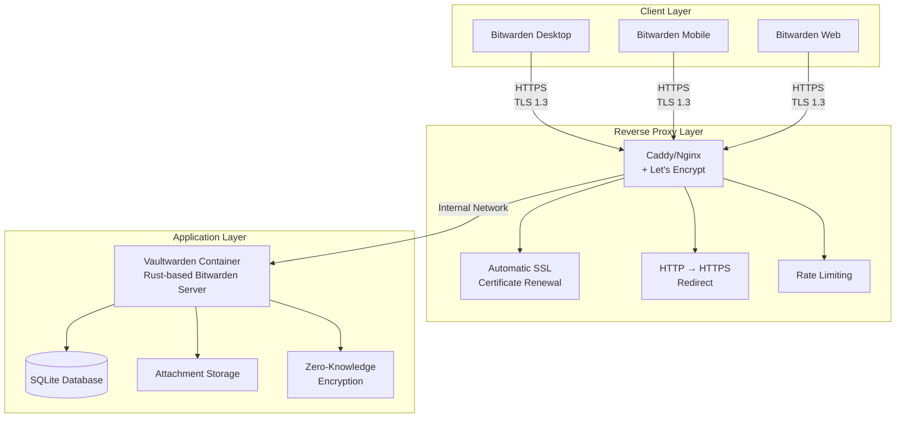
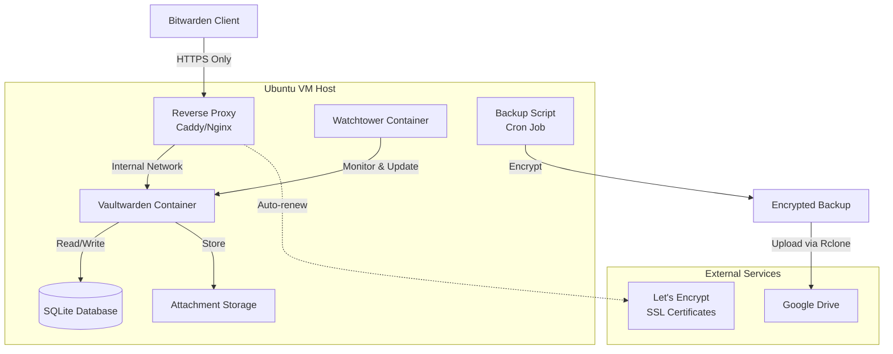
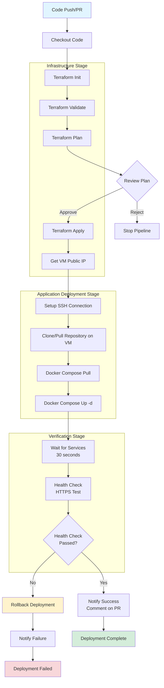

# Technical Specification: Self-Hosted Personal Password Manager

## Table of Contents

1. [Project Overview & Goals](#1-project-overview--goals)
   - 1.1 [Purpose](#11-purpose)
   - 1.2 [Core Objectives](#12-core-objectives)
   - 1.3 [Technical Constraints](#13-technical-constraints)
   - 1.4 [Success Criteria](#14-success-criteria)

2. [System Architecture](#2-system-architecture)
   - 2.1 [High-Level Architecture](#21-high-level-architecture)
   - 2.2 [Component Architecture](#22-component-architecture)
   - 2.3 [Data Flow](#23-data-flow)
   - 2.4 [Technology Stack](#24-technology-stack)

3. [Infrastructure & Deployment Requirements](#3-infrastructure--deployment-requirements)
   - 3.1 [Infrastructure Requirements](#31-infrastructure-requirements)
   - 3.2 [Directory Structure Requirements](#32-directory-structure-requirements)
   - 3.3 [Service Requirements](#33-service-requirements)
   - 3.4 [Security Requirements](#34-security-requirements)
   - 3.5 [Deployment Method Requirements](#35-deployment-method-requirements)
   - 3.6 [Resource Management Requirements](#36-resource-management-requirements)
   - 3.7 [Post-Deployment Requirements](#37-post-deployment-requirements)

4. [Security Specification](#4-security-specification)
   - 4.1 [Zero-Knowledge Architecture](#41-zero-knowledge-architecture)
   - 4.2 [Network Security](#42-network-security)
   - 4.3 [Application Security](#43-application-security)
   - 4.4 [Access Control](#44-access-control)
   - 4.5 [Security Monitoring](#45-security-monitoring)

5. [Data Protection (Backup & Disaster Recovery)](#5-data-protection-backup--disaster-recovery)
   - 5.1 [Backup Strategy](#51-backup-strategy)
   - 5.2 [Disaster Recovery](#52-disaster-recovery)
   - 5.3 [Backup Storage Security](#53-backup-storage-security)

6. [Maintenance & Automation Strategy](#6-maintenance--automation-strategy)
   - 6.1 [Automated Updates](#61-automated-updates)
   - 6.2 [Monitoring & Health Checks](#62-monitoring--health-checks)
   - 6.3 [System Maintenance](#63-system-maintenance)
   - 6.4 [Operational Procedures](#64-operational-procedures)
   - 6.5 [Troubleshooting](#65-troubleshooting)
   - 6.6 [Documentation Maintenance](#66-documentation-maintenance)

- [Appendix A: Quick Reference](#appendix-a-quick-reference)
- [Appendix B: Migration Guide](#appendix-b-migration-guide)

---

## 1. Project Overview & Goals

### 1.1 Purpose

This specification defines a self-hosted, secure, and maintenance-free personal password manager solution based on Vaultwarden (a Rust-based, Bitwarden-compatible server). The system is designed to provide enterprise-grade password management capabilities while maintaining complete data sovereignty and vendor independence.

### 1.2 Core Objectives

- **Security First**: Implement zero-knowledge architecture ensuring the server never has access to plaintext passwords
- **Vendor Agnostic**: Deployable on any infrastructure (Azure VM, AWS EC2, DigitalOcean, local machine, etc.) without vendor lock-in
- **Zero-Touch Maintenance**: Automated updates, backups, and monitoring requiring minimal manual intervention
- **Production Ready**: HTTPS-only access with automatic SSL certificate management
- **Disaster Recovery**: One-command restore capability for complete system recovery

### 1.3 Technical Constraints

- **Initial Deployment Target**: Azure Virtual Machine (Ubuntu LTS)
- **Vendor Independence**: No Azure-specific services (Azure SQL, Azure Backup, etc.)
- **Container-Based**: All services run in Docker containers for portability
- **Network Security**: Only ports 80 and 443 exposed to the internet
- **Protocol Enforcement**: HTTP traffic must be automatically redirected to HTTPS

### 1.4 Success Criteria

- System can be deployed on a fresh Ubuntu VM in under 30 minutes
- Automated backups run nightly without manual intervention
- Container updates are applied automatically within 24 hours of stable release
- Complete system restore can be performed with a single command
- Zero unencrypted data transmission over the network

## 2. System Architecture

### 2.1 High-Level Architecture

The system follows a three-tier architecture:



### 2.2 Component Architecture



### 2.3 Data Flow

#### 2.3.1 Authentication Flow

1. Client sends encrypted credentials to Vaultwarden via HTTPS
2. Vaultwarden performs authentication using encrypted hash comparison
3. Server never sees plaintext master password (zero-knowledge)
4. Session token issued upon successful authentication

#### 2.3.2 Password Storage Flow

1. Client encrypts password entries locally using master password-derived key
2. Encrypted data sent to Vaultwarden via HTTPS
3. Vaultwarden stores encrypted data in SQLite database
4. Server cannot decrypt stored passwords (zero-knowledge)

#### 2.3.3 Backup Flow

1. Cron job triggers backup script nightly
2. Script creates SQLite dump and compresses attachments
3. Backup archive encrypted using GPG with passphrase
4. Encrypted backup uploaded to Google Drive via Rclone
5. Local backup files deleted after successful upload
6. Retention policy: Keep last 30 days of backups

### 2.4 Technology Stack

| Component | Technology | Version | Purpose |
|-----------|-----------|---------|---------|
| **Application Server** | Vaultwarden | Latest stable | Bitwarden-compatible password manager |
| **Reverse Proxy** | Caddy | Latest stable | HTTPS termination, SSL automation |
| **Container Runtime** | Docker | 24.0+ | Container orchestration |
| **Orchestration** | Docker Compose | 2.20+ | Multi-container management |
| **Database** | SQLite | 3.x (embedded) | Data persistence (embedded in Vaultwarden container) |
| **Update Automation** | Watchtower | Latest stable | Container update automation (Caddy & Watchtower only; Vaultwarden uses version pinning) |
| **Backup Tool** | Rclone | Latest stable | Cloud storage synchronization |
| **Encryption** | GPG | 2.x | Backup encryption |
| **SSL Certificates** | Let's Encrypt | Auto-renewed | TLS certificates |
| **Operating System** | Ubuntu LTS | 22.04+ | Host operating system |

## 3. Infrastructure & Deployment Requirements

### 3.1 Infrastructure Requirements

#### 3.1.1 Minimum System Requirements

- **CPU**: 2 vCPUs minimum
- **RAM**: 2 GB minimum (4 GB recommended)
- **Storage**: 20 GB minimum (50 GB recommended for attachments)
- **Network**: Static IP address or dynamic DNS support
- **OS**: Ubuntu 22.04 LTS or later

#### 3.1.2 Network Requirements

- **Inbound Ports**: 
  - Port 80 (HTTP) - Must redirect to HTTPS
  - Port 443 (HTTPS) - Primary access point
- **Outbound Ports**: 
  - Port 443 (HTTPS) - For Let's Encrypt certificate renewal and Google Drive API
- **Firewall**: Must restrict access to ports 80/443 only

#### 3.1.3 Database Requirements

- **Type**: SQLite (embedded in Vaultwarden container)
- **Storage**: Database file must be persisted in mounted volume
- **Backup**: Database must be accessible for backup operations via `sqlite3` CLI tool
- **Note**: SQLite is embedded within the Vaultwarden Docker container and does not require separate installation. The `sqlite3` command-line tool must be available on the host system for backup operations.

### 3.2 Directory Structure Requirements

The system must organize files in the following structure:

```
/opt/vaultwarden/
├── docker-compose.yml          # Container orchestration configuration
├── .env                         # Environment variables (secrets)
├── caddy/
│   ├── Caddyfile               # Reverse proxy configuration
│   └── data/                   # Caddy SSL certificate storage
├── vaultwarden/
│   ├── data/                   # Application data directory
│   │   ├── db.sqlite3          # SQLite database
│   │   └── attachments/        # User file attachments
│   └── config/                 # Application configuration
├── scripts/
│   ├── backup.sh               # Backup automation script
│   ├── restore.sh              # Disaster recovery script
│   └── setup.sh                # Initial deployment script
└── backups/                    # Temporary backup location (local)
```

**Requirements:**
- All directories must be owned by the deployment user
- `.env` file must have restricted permissions (600)
- Data directories must persist across container restarts

### 3.3 Service Requirements

#### 3.3.1 Container Services

The system must deploy the following services:

1. **Vaultwarden Application**
   - Image: `vaultwarden/server:<version>` (pinned to specific stable version, e.g., `1.30.0`)
   - **Update Strategy**: Version pinning with manual updates (Watchtower disabled for Vaultwarden)
   - Must run with restart policy `unless-stopped`
   - Must have access to persistent data volume
   - Must be accessible only via reverse proxy (internal network)
   - Must support WebSocket connections for real-time sync
   - Must have public signups disabled by default
   - **Update Requirements**: 
     - Updates must be applied manually after reviewing release notes
     - Backup must be created before any update
     - Security patches must be applied within 7 days (critical patches within 24-48 hours)
     - See [plan.md](plan.md) Section "Vaultwarden Update Procedure" for detailed update steps

2. **Reverse Proxy (Caddy)**
   - Image: `caddy:latest`
   - Must expose ports 80 and 443
   - Must automatically obtain and renew SSL certificates via Let's Encrypt
   - Must redirect all HTTP traffic to HTTPS
   - Must implement security headers (HSTS, X-Frame-Options, etc.)
   - Must implement rate limiting

3. **Update Automation (Watchtower)**
   - Image: `containrrr/watchtower:latest`
   - Must monitor and update containers automatically (Caddy and Watchtower only)
   - **Vaultwarden Exclusion**: Watchtower must be disabled for Vaultwarden container (uses version pinning)
   - Must clean up old images after updates
   - Must run daily checks
   - **Note**: Vaultwarden updates are manual to ensure controlled deployment after reviewing release notes

#### 3.3.2 Environment Variables

The following environment variables must be configured:

**Required:**
- `ADMIN_TOKEN`: Strong random token for admin panel access
- `DOMAIN`: Full HTTPS URL of the deployment
- `WEBSOCKET_ENABLED`: Enable WebSocket support (default: true)
- `SIGNUPS_ALLOWED`: Allow new user registrations (default: false)
- `DATABASE_URL`: SQLite database path (default: /data/db.sqlite3)

**Backup Configuration:**
- `BACKUP_ENCRYPTION_KEY`: GPG key ID or passphrase for backup encryption
- `RCLONE_REMOTE_NAME`: Name of Rclone remote for Google Drive
- `BACKUP_RETENTION_DAYS`: Number of days to retain backups (default: 30)

For complete configuration examples, see [plan.md](plan.md) and [.env.example](.env.example).

### 3.4 Security Requirements

#### 3.4.1 Reverse Proxy Security

The reverse proxy must implement:

- **Automatic SSL/TLS**: Certificates must be obtained and renewed automatically via Let's Encrypt
- **HTTP to HTTPS Redirect**: All HTTP traffic must redirect to HTTPS
- **Security Headers**:
  - `Strict-Transport-Security`: HSTS with max-age 31536000
  - `X-Frame-Options`: DENY
  - `X-Content-Type-Options`: nosniff
  - `Referrer-Policy`: strict-origin-when-cross-origin
- **Rate Limiting**: Must limit requests per IP to prevent abuse
- **WebSocket Support**: Must support WebSocket connections for real-time synchronization

**Note**: Caddy is the recommended reverse proxy for automatic SSL certificate management. For comparison with Nginx and alternative configurations, see [Reverse Proxy Comparison](docs/reverse-proxy-comparison.md).

#### 3.4.2 Network Security

- Only ports 80 and 443 must be exposed to the internet
- All internal container communication must use Docker networks
- Firewall must be configured to deny all traffic except 80/443

### 3.5 Deployment Method Requirements

The system must support two deployment methods:

#### 3.5.1 Automated Deployment (Recommended)

**Requirements:**
- Infrastructure must be provisioned using Infrastructure as Code (Terraform)
- Deployment must be automated via CI/CD pipelines
- Infrastructure changes must be version-controlled
- Deployment must support rollback capability
- Must support multi-cloud deployment (Azure, AWS, GCP)

**Infrastructure as Code Requirements:**
- Must provision VM with required specifications (Section 3.1.1)
- Must configure networking and security groups
- Must set up public IP address
- Must implement resource tagging for cost tracking
- Must use cloud-init for automated VM setup

**CI/CD Pipeline Requirements:**
- Must validate infrastructure changes before deployment
- Must deploy application code to provisioned infrastructure
- Must perform health checks after deployment
- Must support automated rollback on failure

**CI/CD Pipeline Workflow:**

The automated deployment pipeline must follow this workflow:



**Pipeline Stages:**

1. **Infrastructure Stage**: Terraform provisions or updates Azure resources (VM, networking, security groups)
2. **Application Deployment Stage**: Application code is deployed to the VM via SSH
3. **Verification Stage**: Health checks verify the deployment succeeded

For detailed implementation steps, see [plan.md](plan.md) and [CI/CD Pipelines Guide](docs/cicd-pipelines.md).

#### 3.5.2 Manual Deployment (Alternative)

**Requirements:**
- Must support deployment on pre-provisioned VM
- Must provide setup script for initial server configuration
- Must support step-by-step manual configuration
- Must allow manual verification at each step

For detailed implementation steps, see [plan.md](plan.md).


### 3.6 Resource Management Requirements

#### 3.6.1 Resource Tagging

All cloud resources must be tagged with the following tags for cost tracking and management:

| Tag Key | Required Value | Purpose |
|---------|---------------|---------|
| `Project` | `password-manager` | Project identification |
| `Environment` | `production` | Environment classification |
| `Component` | `vaultwarden` | Application component |
| `ManagedBy` | `terraform` or `manual` | Management method |
| `CostCenter` | `personal` | Cost allocation |
| `Backup` | `enabled` | Backup status |
| `Owner` | `<email>` | Resource owner |

#### 3.6.2 Cost Constraints

- **Monthly Budget**: ₹4,500/month Azure credits
- **Target Cost**: ₹3,000 - ₹4,600/month for recommended setup
- **Cost Monitoring**: Must implement cost alerts at 89% and 98% of monthly credits
- **Cost Tracking**: Must use resource tags for cost analysis

For detailed cost breakdown, optimization strategies, and monitoring setup, see [Cost Analysis](docs/cost-analysis.md) and [plan.md](plan.md).

### 3.7 Post-Deployment Requirements

#### 3.7.1 Initial Configuration

After deployment, the following must be configured:

- **Admin Account**: First user account must be created via admin panel
- **Backup Automation**: Nightly backup cron job must be configured
- **Health Monitoring**: Optional health check monitoring must be available

#### 3.7.2 Backup Requirements

- Backups must run automatically on a schedule (recommended: nightly at 2 AM)
- Backups must include SQLite database and attachments
- Backups must be encrypted before upload
- Backups must be uploaded to Google Drive via Rclone
- Backup retention must be configurable (default: 30 days)

For detailed backup and disaster recovery procedures, see Section 5 and [plan.md](plan.md).

## 4. Security Specification

### 4.1 Zero-Knowledge Architecture

#### 4.1.1 Encryption Model

Vaultwarden implements a zero-knowledge architecture where:

- **Client-Side Encryption**: All password entries are encrypted on the client device using a key derived from the user's master password
- **Server-Side Storage**: The server stores only encrypted blobs and cannot decrypt them
- **Master Password**: Never transmitted to the server; only a hash is sent for authentication
- **Key Derivation**: Uses PBKDF2 with 100,000 iterations (configurable) to derive encryption keys

#### 4.1.2 Authentication Flow

1. User enters master password on client
2. Client derives authentication hash using PBKDF2
3. Hash sent to server over HTTPS
4. Server compares hash with stored hash (bcrypt)
5. Server never receives plaintext master password

#### 4.1.3 Data Encryption

- **Encryption Algorithm**: AES-256-CBC for vault data
- **Key Management**: Keys derived from master password, never stored
- **Initialization Vector**: Unique IV per encrypted item
- **Integrity**: HMAC-SHA256 for data integrity verification

### 4.2 Network Security

#### 4.2.1 Firewall Requirements

- **Default Policy**: Must deny all incoming traffic by default
- **Outbound Traffic**: Must allow all outbound traffic
- **Allowed Ports**: Only ports 80 (HTTP) and 443 (HTTPS) must be open
- **Firewall Tool**: UFW (Uncomplicated Firewall) must be configured and enabled

For firewall configuration steps, see [plan.md](plan.md).

#### 4.2.2 TLS/SSL Configuration

- **Minimum TLS Version**: TLS 1.2 (TLS 1.3 preferred)
- **Certificate Authority**: Let's Encrypt (automatic renewal)
- **Certificate Renewal**: Automatic via Caddy or Certbot
- **Cipher Suites**: Strong ciphers only (ECDHE, AES-GCM)
- **HSTS**: Enabled with 1-year max-age

#### 4.2.3 HTTP Security Headers

- **Strict-Transport-Security**: Force HTTPS for 1 year
- **X-Frame-Options**: DENY (prevent clickjacking)
- **X-Content-Type-Options**: nosniff (prevent MIME sniffing)
- **Referrer-Policy**: strict-origin-when-cross-origin
- **Content-Security-Policy**: Restrict resource loading

### 4.3 Application Security

#### 4.3.1 Signup Restrictions

- **Public Signups**: Disabled after initial admin account creation
- **Admin Token**: Required for administrative operations
- **Rate Limiting**: Implemented at reverse proxy level (50 requests/minute per IP)

#### 4.3.2 Container Security

- **Non-Root User**: Vaultwarden runs as non-root user inside container
- **Read-Only Root Filesystem**: Where possible, mount volumes as read-only
- **Resource Limits**: Set CPU and memory limits in docker-compose.yml
- **Network Isolation**: Containers communicate via isolated Docker network

#### 4.3.3 Secrets Management

- **Environment Variables**: Sensitive data stored in `.env` file
- **File Permissions**: `.env` file restricted to owner read-only (600)
- **Admin Token**: Generated using cryptographically secure random generator
- **Backup Encryption**: Separate GPG key for backup encryption

### 4.4 Access Control

#### 4.4.1 User Authentication

- **Master Password**: Minimum 8 characters (enforced by client)
- **Two-Factor Authentication**: Supported via TOTP (Time-based One-Time Password)
- **Session Management**: Configurable session timeout
- **Failed Login Protection**: Rate limiting prevents brute force attacks

#### 4.4.2 Administrative Access

- **Admin Panel**: Accessible only via `/admin` endpoint with `ADMIN_TOKEN`
- **Admin Token**: Must be strong, randomly generated (minimum 32 characters)
- **Token Rotation**: Admin token can be regenerated and updated in `.env`

### 4.5 Security Monitoring

#### 4.5.1 Logging

- **Access Logs**: Reverse proxy logs all HTTP requests
- **Application Logs**: Vaultwarden logs authentication attempts and errors
- **Backup Logs**: Backup script logs all backup operations
- **Log Retention**: 30 days local, archived in backups

#### 4.5.2 Security Updates

- **Container Updates**: 
  - Vaultwarden: Manual updates with version pinning (see [plan.md](plan.md) Section "Vaultwarden Update Procedure")
  - Caddy & Watchtower: Automated via Watchtower (daily checks)
- **OS Updates**: Manual or automated via unattended-upgrades
- **Dependency Updates**: Handled through container image updates

## 5. Data Protection (Backup & Disaster Recovery)

### 5.1 Backup Strategy

#### 5.1.1 Backup Components

The backup process captures:

1. **SQLite Database**: Complete database dump (`db.sqlite3`)
2. **Attachments**: All user-uploaded files from `attachments/` directory
3. **Configuration**: Vaultwarden configuration files (if any custom configs)

#### 5.1.1.1 Understanding Attachments and Attachment Store

**Attachments** are files (documents, images, certificates, etc.) that users can securely attach to password entries. They are encrypted client-side (zero-knowledge) and stored separately from the database for performance.

**Attachment Store** location: `/opt/vaultwarden/vaultwarden/data/attachments/`

For detailed information on attachments architecture, encryption, size limits, and optimization, see [Attachments Explained](docs/attachments-explained.md).

#### 5.1.2 Backup Process Requirements

The backup process must:
- Create SQLite database backup using `.backup` command
- Archive attachments directory
- Create backup manifest with metadata
- Encrypt backup using GPG (AES-256)
- Upload encrypted backup to Google Drive via Rclone
- Clean up local temporary files after successful upload
- Apply retention policy to remove old backups

For backup script implementation, see [plan.md](plan.md).

#### 5.1.3 Backup Schedule

- **Frequency**: Nightly at 2:00 AM (configurable)
- **Retention**: 30 days (configurable via `BACKUP_RETENTION_DAYS`)
- **Storage Location**: Google Drive (encrypted)
- **Local Storage**: Temporary only (deleted after upload)

#### 5.1.4 Backup Encryption Requirements

- **Encryption Method**: Must use GPG (GNU Privacy Guard)
- **Encryption Algorithm**: AES-256
- **Key Management**: Supports two methods:
  - **Passphrase**: Cryptographically secure random passphrase
  - **Key Pair**: GPG key pair with public key export capability
- **Encryption Key Storage**: Must be stored in `.env` file with restricted permissions

For encryption key generation steps, see [plan.md](plan.md).

### 5.2 Disaster Recovery

#### 5.2.1 Recovery Scenarios

The system supports recovery from:

1. **Complete VM Failure**: Restore from Google Drive backup to new VM
2. **Data Corruption**: Restore from most recent backup
3. **Accidental Deletion**: Restore from point-in-time backup
4. **Ransomware Attack**: Restore from encrypted backup (server compromise)

#### 5.2.2 Restore Process Requirements

The restore process must:
- Download encrypted backup from Google Drive
- Decrypt backup using GPG with stored encryption key
- Extract backup archive
- Stop Vaultwarden container before restore
- Restore SQLite database to data directory
- Restore attachments directory
- Restart Vaultwarden container
- Clean up temporary files

For restore script implementation and step-by-step procedures, see [plan.md](plan.md).

#### 5.2.3 Backup Verification Requirements

- **Frequency**: Monthly verification recommended
- **Verification Steps**: Must verify database integrity and attachment presence
- **Testing**: Optional test restore on isolated environment

For backup verification procedures, see [plan.md](plan.md).

### 5.3 Backup Storage Security

#### 5.3.1 Google Drive Configuration

- **Rclone Encryption**: Optional additional layer (rclone crypt remote)
- **Access Control**: Google Drive account with 2FA enabled
- **API Scopes**: Minimal required scopes (drive.file)
- **Service Account**: Optional (for automated access without personal account)

#### 5.3.2 Encryption Key Management

- **Storage**: Encryption key stored in `.env` file (600 permissions)
- **Backup**: Encryption key should be backed up separately (password manager, secure note)
- **Rotation**: Encryption key can be rotated by re-encrypting all backups

## 6. Maintenance & Automation Strategy

### 6.1 Automated Updates

#### 6.1.1 Watchtower Configuration

Watchtower automatically monitors and updates containers (Caddy and Watchtower only):

- **Update Check**: Daily at 2:00 AM (configurable)
- **Update Strategy**: Pull latest image and restart container
- **Cleanup**: Removes old images after update
- **Notifications**: Optional email/webhook notifications
- **Vaultwarden Exclusion**: Watchtower is disabled for Vaultwarden container (label: `com.centurylinklabs.watchtower.enable=false`)

#### 6.1.2 Vaultwarden Update Strategy

Vaultwarden uses **version pinning** with manual updates for controlled deployment:

- **Image Tag**: Pinned to specific stable version (e.g., `vaultwarden/server:1.30.0`)
- **Update Method**: Manual updates after reviewing release notes
- **Update Source**: [Vaultwarden GitHub Releases](https://github.com/dani-garcia/vaultwarden/releases)
- **Update Frequency**: 
  - Security patches: Within 7 days (critical patches: 24-48 hours)
  - Stable releases: Monthly review recommended
- **Pre-Update Requirement**: Backup must be created before any update
- **Update Procedure**: See [plan.md](plan.md) Section "Vaultwarden Update Procedure" for detailed steps

**Rationale**: Version pinning provides:
- Control over update timing
- Ability to review release notes and breaking changes
- Opportunity to test updates before production deployment
- Reduced risk of unexpected updates breaking functionality

#### 6.1.3 Update Process (Watchtower-managed containers)

For containers managed by Watchtower (Caddy, Watchtower):

1. Watchtower checks for new image versions
2. Downloads new image if available
3. Stops old container gracefully
4. Starts new container with same configuration
5. Removes old image to save disk space

#### 6.1.4 Vaultwarden Update Verification

After manual Vaultwarden update:

1. Check container logs: `docker logs vaultwarden`
2. Verify service accessibility: `curl https://your-domain.com`
3. Test authentication with client
4. Verify WebSocket connection (real-time sync)
5. Monitor for 24 hours for any issues
6. Verify backup was successful before update

#### 6.1.5 Manual Update Procedure

For Vaultwarden updates, follow the detailed procedure in [plan.md](plan.md) Section "Vaultwarden Update Procedure". Quick reference:

```bash
cd /opt/vaultwarden
./scripts/backup.sh  # Always backup first!
# Update version in docker-compose.yml
docker-compose pull vaultwarden
docker-compose stop vaultwarden
docker-compose up -d vaultwarden
docker-compose logs -f vaultwarden  # Monitor for errors
```

### 6.2 Monitoring & Health Checks

#### 6.2.1 Health Check Endpoints

- **Vaultwarden**: `https://your-domain.com/` (should return 200)
- **Admin Panel**: `https://your-domain.com/admin` (requires admin token)
- **WebSocket**: `wss://your-domain.com/notifications/hub` (for real-time sync)

#### 6.2.2 Log Monitoring

**Key Log Files:**

- Vaultwarden logs: `docker logs vaultwarden`
- Caddy logs: `docker logs caddy`
- Backup logs: `/var/log/vaultwarden-backup.log`
- System logs: `/var/log/syslog`

#### 6.2.3 Automated Health Checks

Create a simple health check script (`scripts/health-check.sh`):

```bash
#!/bin/bash

DOMAIN="${DOMAIN:-https://your-domain.com}"
ALERT_EMAIL="${ALERT_EMAIL}"

# Check if service is responding
HTTP_CODE=$(curl -s -o /dev/null -w "%{http_code}" "${DOMAIN}")

if [ "${HTTP_CODE}" != "200" ]; then
    echo "[$(date)] Health check failed: HTTP ${HTTP_CODE}"
    if [ -n "${ALERT_EMAIL}" ]; then
        echo "Vaultwarden health check failed" | mail -s "Alert: Vaultwarden Down" "${ALERT_EMAIL}"
    fi
    exit 1
fi

# Check container status
if ! docker ps | grep -q vaultwarden; then
    echo "[$(date)] Health check failed: Container not running"
    exit 1
fi

echo "[$(date)] Health check passed"
exit 0
```

Add to crontab (every 15 minutes):

```bash
*/15 * * * * /opt/vaultwarden/scripts/health-check.sh >> /var/log/vaultwarden-health.log 2>&1
```

### 6.3 System Maintenance

#### 6.3.1 OS Updates

**Automated OS Updates (Optional):**

```bash
sudo apt-get install -y unattended-upgrades
sudo dpkg-reconfigure -plow unattended-upgrades
```

**Manual OS Updates:**

```bash
sudo apt-get update
sudo apt-get upgrade -y
sudo reboot  # If kernel updated
```

#### 6.3.2 Disk Space Management

**Monitor Disk Usage:**

```bash
# Check disk usage
df -h

# Check Docker disk usage
docker system df

# Clean up Docker (removes unused images, containers, volumes)
docker system prune -a --volumes
```

**Automated Cleanup Script:**

```bash
#!/bin/bash
# Clean up old Docker images and containers
docker system prune -f --volumes

# Clean up old logs (keep last 7 days)
find /var/log -name "*.log" -mtime +7 -delete
```

#### 6.3.3 Database Maintenance

**SQLite Maintenance:**

```bash
# Vacuum database (reclaim space)
docker exec vaultwarden sqlite3 /data/db.sqlite3 "VACUUM;"

# Analyze database (update statistics)
docker exec vaultwarden sqlite3 /data/db.sqlite3 "ANALYZE;"

# Integrity check
docker exec vaultwarden sqlite3 /data/db.sqlite3 "PRAGMA integrity_check;"
```

**Monthly Maintenance Task:**

Add to crontab (first day of month):

```bash
0 3 1 * * docker exec vaultwarden sqlite3 /data/db.sqlite3 "VACUUM; ANALYZE;"
```

### 6.4 Operational Procedures

#### 6.4.1 Service Restart

```bash
cd /opt/vaultwarden
docker-compose restart
```

#### 6.4.2 Service Stop

```bash
cd /opt/vaultwarden
docker-compose stop
```

#### 6.4.3 Service Start

```bash
cd /opt/vaultwarden
docker-compose start
```

#### 6.4.4 View Logs

```bash
# All services
docker-compose logs -f

# Specific service
docker-compose logs -f vaultwarden
docker-compose logs -f caddy
```

#### 6.4.5 Backup Status Check

```bash
# Check last backup
tail -n 50 /var/log/vaultwarden-backup.log

# List backups in Google Drive
rclone lsf gdrive:vaultwarden-backups/
```

### 6.5 Troubleshooting

For common issues, solutions, emergency procedures, debugging steps, and performance troubleshooting, see [Troubleshooting Guide](docs/troubleshooting.md).

### 6.6 Documentation Maintenance

#### 6.6.1 Configuration Documentation

Maintain a local `CONFIG.md` file with:

- Domain name
- Admin token (stored securely)
- Backup encryption key (stored securely)
- Rclone remote name
- Custom configurations

#### 6.6.2 Change Log

Maintain a `CHANGELOG.md` to track:

- Configuration changes
- Manual interventions
- Update dates
- Known issues

---

## Appendix A: Quick Reference

### A.1 Essential Commands

```bash
# Start services
cd /opt/vaultwarden && docker-compose up -d

# Stop services
cd /opt/vaultwarden && docker-compose stop

# View logs
docker-compose logs -f

# Manual backup
./scripts/backup.sh

# Restore backup
./scripts/restore.sh <backup-file>

# Check health
./scripts/health-check.sh

# Update containers
docker-compose pull && docker-compose up -d
```

### A.2 File Locations

- **Configuration**: `/opt/vaultwarden/.env`
- **Docker Compose**: `/opt/vaultwarden/docker-compose.yml`
- **Data**: `/opt/vaultwarden/vaultwarden/data/`
- **Backups**: `/opt/vaultwarden/backups/`
- **Scripts**: `/opt/vaultwarden/scripts/`
- **Logs**: `/var/log/vaultwarden-*.log`

### A.3 Environment Variables

| Variable | Description | Required |
|----------|-------------|----------|
| `ADMIN_TOKEN` | Admin panel access token | Yes |
| `DOMAIN` | Full domain URL with https:// | Yes |
| `BACKUP_ENCRYPTION_KEY` | GPG key/passphrase for backups | Yes |
| `RCLONE_REMOTE_NAME` | Rclone remote name for Google Drive | Yes |
| `BACKUP_RETENTION_DAYS` | Number of days to keep backups | No (default: 30) |

---

## Appendix B: Migration Guide

For detailed migration procedures, vendor-specific notes, step-by-step migration process, and rollback procedures, see [Migration Guide](docs/migration-guide.md).

---

**Document Version**: 1.0  
**Last Updated**: 2024  
**Maintained By**: DevOps Team
